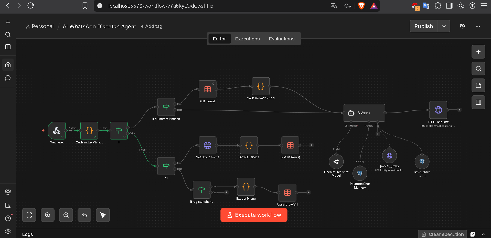

# 🤖 AI WhatsApp Dispatch Agent

> An AI-powered WhatsApp dispatch system built with n8n, Evolution API, OpenRouter, and PostgreSQL.


An AI Agent designed to manage customer requests for **parcel delivery, food delivery, and passenger transportation** through WhatsApp.

The system connects customers with a dispatch workflow that can collect order information, process locations, identify the nearest available captain, dispatch the order, and store confirmed orders.

---

## 🧩 Workflow Architecture

The entire automation is built using **n8n**, with WhatsApp communication handled through **Evolution API**.

The workflow connects the customer, AI Agent, WhatsApp captain groups, location processing, database, and dispatch logic into one automated system.



> **Note:** The workflow screenshot will be added to the `screenshots/` directory.

---

## 🚀 How It Works

The system follows this general flow:

```text
Customer
   │
   ▼
WhatsApp
   │
   ▼
Evolution API
   │
   ▼
n8n Webhook
   │
   ▼
Message Parser
   │
   ▼
AI Agent
   │
   ├── Identify Service
   │
   ├── Collect Customer Information
   │
   └── Process Location
           │
           ▼
    Captain WhatsApp Group
           │
           ▼
    Captain Locations
           │
           ▼
    Distance Calculation
           │
           ▼
    Nearest Captain
           │
           ▼
    Customer Confirmation
           │
           ▼
      Dispatch Order
           │
           ├───────────────┐
           ▼               ▼
    Captain Group      PostgreSQL
```

---

# ✨ Features

* 🤖 AI-powered WhatsApp conversations
* 📦 Parcel delivery dispatch
* 🍔 Food delivery request handling
* 🚕 Passenger transportation request handling
* 📍 Customer location processing
* 👨‍✈️ Captain location collection
* 📏 Nearest captain calculation
* 🗺️ Google Maps location links
* 💾 PostgreSQL order storage
* 🧠 Persistent conversation memory
* 📊 Captain management using n8n Data Tables
* 🔌 Evolution API integration
* ⚙️ Fully automated n8n workflow
* 🌐 Arabic and English conversation support
* 🐳 Docker-based self-hosted architecture

---

# 🧠 Why This Is More Than a Chatbot

This project is designed to demonstrate the difference between a traditional chatbot and an operational AI Agent.

A traditional chatbot might only do this:

```text
Customer → Message → AI → Response
```

This system goes further:

```text
Customer
   ↓
AI Agent
   ↓
Business Logic
   ↓
Location Processing
   ↓
Captain Network
   ↓
Nearest Captain
   ↓
Order Dispatch
   ↓
Database
```

The AI Agent is therefore part of the actual business operation instead of simply generating text responses.

---

# 🤖 AI Agent

The AI Agent is the main conversational component of the system.

It is responsible for:

* Understanding customer requests
* Detecting the required service
* Asking for missing information
* Maintaining conversation context
* Processing customer locations
* Confirming order information
* Calling the required tools
* Communicating the final result to the customer

The Agent can handle both Arabic and English conversations.

---

# 🛠️ AI Agent Tools

The current AI Agent uses two main tools.

## 📦 `parcel_group`

This tool communicates with the parcel captain WhatsApp group.

It is used during the parcel dispatch process to:

1. Request available captain locations.
2. Send the confirmed order to the parcel captain group.

---

## 💾 `save_order`

This tool stores confirmed orders in PostgreSQL.

The order can contain:

```text
WhatsApp ID
Service
Customer Name
Customer Phone
Timing
Pickup Location
Drop-off Location
Description
Notes
Nearest Captain
```

---

# 📍 Captain Dispatch System

The system uses WhatsApp groups to communicate with captains.

Captains can send their location to the appropriate group.

The workflow then stores the captain's information in an n8n Data Table.

Example:

```text
Captain
   │
   ├── Name
   ├── Phone
   ├── Service
   ├── Group
   ├── Latitude
   ├── Longitude
   └── Last Updated
```

This information can later be used to determine which captain is closest to the customer's pickup location.

---

# 📏 Nearest Captain Calculation

The workflow calculates the distance between the customer and available captains.

```text
Customer Pickup
       │
       ├───────────────┐
       │               │
       ▼               ▼
   Captain A        Captain B
    2.4 km            5.8 km
       │
       ▼
Nearest Captain
```

The JavaScript logic uses the **Haversine formula** to calculate geographical distance based on latitude and longitude.

The workflow then sorts available captains by distance and identifies the closest one.

---

# ⏱️ ETA Estimation

The current prototype uses an approximate speed of:

```text
25 km/h
```

The estimated time is calculated from the distance.

```text
ETA = Distance / Average Speed
```

This is a simplified estimate for the prototype.

It does **not** currently use live traffic or real road routing.

A future version can integrate a routing service to provide more accurate:

* Road distance
* Travel time
* Traffic conditions
* Route information

---

# 📱 Captain Registration

The workflow includes a captain registration flow.

A captain can register their WhatsApp number through a registration message.

The workflow:

```text
Registration Message
        ↓
Detect Registration
        ↓
Extract Phone Number
        ↓
Normalize Number
        ↓
Save Captain
```

The phone-number parser supports Arabic and English digits.

The current configuration uses Egypt as the default country code and can be adapted for other countries.

---

# 🧩 n8n Workflow Components

The workflow contains several logical sections.

### Webhook

Receives incoming events from Evolution API.

---

### Message Parser

A JavaScript node processes incoming WhatsApp events and extracts information such as:

* Message text
* Sender
* WhatsApp ID
* Message type
* Group ID
* Location
* Customer information

It also handles different WhatsApp message formats.

---

### Customer Message Filter

Separates private customer conversations from WhatsApp group messages.

This prevents captain-group messages from being processed as normal customer requests.

---

### Location Processing

Customer location messages are detected and processed separately.

The workflow can extract coordinates and generate a Google Maps location link.

---

### Captain Data Lookup

The workflow retrieves captain records from an n8n Data Table.

---

### Distance Calculation

JavaScript calculates the distance between the customer's pickup location and available captains.

---

### Group Service Detection

The workflow identifies the service associated with a WhatsApp group.

Possible services include:

```text
Parcel
Food
Passenger
```

---

### Captain Registration

Captain registration messages are detected, normalized, and stored.

---

### PostgreSQL Chat Memory

Conversation history is stored using PostgreSQL Chat Memory.

The customer's WhatsApp ID is used as the session identifier.

This allows the AI Agent to maintain conversation context.

---

### PostgreSQL Order Storage

Confirmed orders are stored in PostgreSQL for persistent data management.

---

# 🗄️ Data Structure

## Captain Data

A captain record can contain:

```text
Captain ID
Name
Phone
Service
Group ID
Latitude
Longitude
Updated At
```

Example:

```json
{
  "name": "Captain Ali",
  "phone": "9627XXXXXXXX",
  "service": "parcel",
  "group_id": "YOUR_PARCEL_GROUP_ID@g.us",
  "lat": 31.95,
  "lng": 35.91
}
```

---

## Order Data

Confirmed orders can contain:

```text
whatsapp_id
service
customer_name
customer_phone
timing
pickup_link
dropoff_link
description
notes
nearest_captain
```

---

# 📦 Supported Services

| Service      | Status        | Description                        |
| ------------ | ------------- | ---------------------------------- |
| 📦 Parcel    | ✅ Implemented | Full dispatch workflow             |
| 🍔 Food      | 🟡 Partial    | Request and information collection |
| 🚕 Passenger | 🟡 Partial    | Request and information collection |

The **parcel workflow is currently the most complete dispatch implementation**.

Food and passenger dispatch can be extended using the same architecture.

---

# 🏗️ Technology Stack

| Technology            | Purpose                                  |
| --------------------- | ---------------------------------------- |
| **n8n**               | Workflow automation                      |
| **Evolution API**     | WhatsApp integration                     |
| **OpenRouter**        | LLM access                               |
| **PostgreSQL**        | Orders and conversation memory           |
| **n8n Data Tables**   | Captain data                             |
| **JavaScript**        | Data processing and distance calculation |
| **Docker**            | Self-hosted infrastructure               |
| **Google Maps Links** | Location sharing                         |

---

# ⚙️ Installation

## Requirements

Before running the project, you need:

* n8n
* Evolution API
* WhatsApp account
* OpenRouter access
* PostgreSQL
* Docker

---

## 1. Clone the Repository

```bash
git clone https://github.com/BahaaGomaa1/ai-whatsapp-dispatch-agent.git

cd ai-whatsapp-dispatch-agent
```

---

## 2. Install and Configure n8n

Run your n8n instance using your preferred deployment method.

Docker is recommended for a self-hosted environment.

---

## 3. Configure Evolution API

Deploy Evolution API and connect your WhatsApp instance.

You will need:

* Evolution API base URL
* API key
* WhatsApp instance
* Webhook configuration

---

## 4. Configure PostgreSQL

Create a PostgreSQL database and configure it inside n8n.

PostgreSQL is used for:

* Chat memory
* Confirmed orders

---

## 5. Configure OpenRouter

Create an OpenRouter API credential inside n8n and connect it to the AI model node.

---

## 6. Import the Workflow

Import:

```text
workflow.example.json
```

into n8n.

---

# 🔐 Configuration

The public workflow contains placeholders instead of production credentials.

Configure the following values in your own environment:

```text
YOUR_EVOLUTION_API_BASE_URL
YOUR_EVOLUTION_API_KEY
YOUR_WHATSAPP_INSTANCE
YOUR_PARCEL_GROUP_ID
YOUR_CAPTAINS_DATA_TABLE_ID
YOUR_OPENROUTER_CREDENTIAL_ID
YOUR_POSTGRES_CREDENTIAL_ID
YOUR_PROJECT_ID
```

Do not publish real credentials in the repository.

---

# 🔒 Security

Never commit sensitive information such as:

```text
API Keys
Passwords
Database Credentials
WhatsApp Session Data
Private Tokens
Production Webhook URLs
Private Group IDs
```

Use placeholders in the public workflow:

```text
YOUR_API_KEY
YOUR_INSTANCE
YOUR_GROUP_ID
YOUR_DATABASE_CREDENTIAL
```

If a production credential is accidentally exposed, rotate it immediately.

---

# 💬 Example Customer Conversation

```text
Customer:
السلام عليكم

AI:
وعليكم السلام ورحمة الله وبركاته.
كيف يمكنني مساعدتك؟

Customer:
بدي أرسل طرد

AI:
أكيد، ممكن ترسل لي موقع استلام الطرد؟

Customer:
[Customer Location]

AI:
تمام، جاري البحث عن أقرب كابتن متاح.

AI:
وجدنا كابتن قريب منك.
هل ترغب في المتابعة؟

Customer:
نعم

AI:
ممتاز، ممكن اسمك ورقم الهاتف؟

Customer:
محمد
07XXXXXXXX

AI:
تمام، هل تريد إرسال الطرد الآن؟

Customer:
نعم

AI:
تم تأكيد الطلب، وسيتم إرسال التفاصيل إلى الكابتن.
```

---

# 🔄 Complete Parcel Flow

The complete parcel workflow can be summarized as:

```text
1. Customer starts conversation
        ↓
2. AI identifies parcel request
        ↓
3. AI collects pickup location
        ↓
4. Workflow requests captain locations
        ↓
5. Captains send their locations
        ↓
6. Locations are stored
        ↓
7. Workflow calculates distances
        ↓
8. Nearest captain is identified
        ↓
9. AI confirms the order with customer
        ↓
10. Customer provides required details
        ↓
11. AI confirms order
        ↓
12. Order is sent to captain group
        ↓
13. Order is stored in PostgreSQL
```

---

# ⚠️ Current Limitations

This project is currently a portfolio prototype and can be extended further.

Current limitations include:

* ETA is based on simplified distance and speed calculations.
* Road routing is not currently used.
* Real-time traffic is not included.
* Parcel dispatch is the most complete service.
* Food dispatch is not fully implemented.
* Passenger dispatch is not fully implemented.
* Captain acceptance/rejection is not fully automated.
* Automatic pricing is not implemented.
* Full order-status tracking is not implemented.

---

# 🚀 Future Improvements

Planned improvements can include:

* 🗺️ Real-time routing API
* 📍 Accurate road distance
* ⏱️ Live ETA
* 👨‍✈️ Captain accept/reject system
* 🔄 Automatic captain reassignment
* 💰 Dynamic pricing
* 📦 Order status tracking
* 🔔 Customer status notifications
* 🍔 Complete food dispatch
* 🚕 Complete passenger dispatch
* 📊 Admin dashboard
* 📈 Dispatch analytics
* 🧾 Automatic receipts
* 🔐 Advanced webhook security
* ⚡ Real-time state management
* 📱 Customer tracking

---

# 🎯 Project Objective

The main objective of this project is to demonstrate how AI Agents can be integrated into real operational workflows.

Instead of building an AI chatbot that only answers questions, this system allows an AI Agent to interact with:

```text
Customer
   ↓
WhatsApp
   ↓
AI Agent
   ↓
Business Logic
   ↓
Location Data
   ↓
Captain Network
   ↓
Dispatch
   ↓
Database
```

This architecture demonstrates how AI can become part of an actual business process.

---

# 📁 Repository Structure

```text
ai-whatsapp-dispatch-agent/
│
├── README.md
├── workflow.example.json
├── .gitignore
├── LICENSE
│
└── screenshots/
    ├── n8n-workflow.png
    └── whatsapp-demo.png
```

---

# 👨‍💻 Author

**Bahaa Gomaa**

AI Automation & AI Agent Developer

GitHub:

`https://github.com/BahaaGomaa1`

---

## ⭐ Project

If you find this project interesting, feel free to explore the workflow and use the architecture as a starting point for your own AI automation projects.
